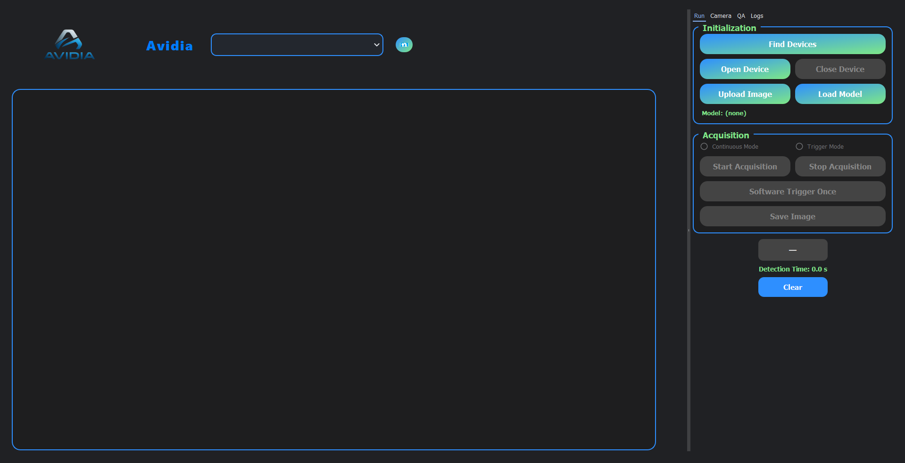

# 🧠 Vision Inspection System

A high-performance **industrial machine vision software** developed by **Abhishek Vashisth**.  
This system automates **visual inspection**, **defect detection**, and **telemetry reporting** using **Hikrobot industrial cameras**, **YOLOv8 segmentation models**, and **PLC (Modbus)** communication.

---

## ⚙️ Key Features
- 📸 Real-time **camera streaming** and control using **Hikrobot MVS SDK**
- 🧠 Integrated **YOLOv8-Seg** inference for detection and segmentation
- 🧰 Full **PyQt5 GUI** with operator-friendly dashboards
- 📡 **Telemetry and Modbus TCP** integration for PLC communication
- ⚡ **Trigger-based** or **continuous** acquisition modes
- 🧾 Auto-logging and status monitoring (OK/NG classification)
- 🔁 YOLO model loading, switching, and on-the-fly inference

---

## 🧩 Tech Stack

| Category | Technology |
|-----------|-------------|
| Language | Python 3.x |
| Framework | PyQt5 |
| AI Model | YOLOv8 (Ultralytics) |
| Vision SDK | Hikrobot MVS SDK |
| Communication | Modbus TCP, REST API |
| UI Theme | QDarkTheme |
| Database/Telemetry | ThingsBoard (Localhost Server) |

---

## 🧠 Architecture Overview

```
┌────────────────────────────┐
│         GUI Layer          │
│  (PyQt5 - app_window.py)   │
└────────────┬───────────────┘
             │
┌────────────▼───────────────┐
│    CameraOperation Class    │
│ (Acquisition + YOLO + PLC) │
└────────────┬───────────────┘
             │
┌────────────▼───────────────┐
│   YOLOv8 Inference Engine  │
│   (Segmentation + Labels)  │
└────────────┬───────────────┘
             │
┌────────────▼───────────────┐
│ Telemetry/Modbus Interface │
│  (Data sync + Feedback)    │
└────────────────────────────┘
```

---

## 🚀 How to Run

1. **Install Dependencies**
   ```bash
   pip install -r requirements.txt
   ```

2. **Install Hikrobot MVS SDK**
   - Download and install the Hikrobot SDK compatible with your camera.

3. **Launch the Application**
   ```bash
   python Gui.py
   ```

4. **Optional**
   - Update YOLO model path and ThingsBoard URL in `CamOperation_class.py`.

---

## 📸 Screenshots / UI Preview


---

## 🧾 Author

**Abhishek Vashisth**  
B.Tech in Computer Science (4th Year)  
Passionate about industrial automation, machine vision, and intelligent inspection systems.  

📧 **Contact:** [abhishekvashisth3404@gmail.com]  
🌐 **GitHub:** [github.com/abhishek-vashisth](https://github.com/abhishek-vashisth)

---

## ⚠️ License

This project is licensed under a **Proprietary License** © 2025 **Abhishek Vashisth**.  
All rights reserved.

You may view or study the source code for educational purposes only.  
Reproduction, modification, distribution, or commercial use without **written consent** from the author is strictly prohibited.  

See the [LICENSE](./LICENSE.txt) file for full details.
For licensing inquiries, contact: [abhishekvashisth3404@gmail.com]


